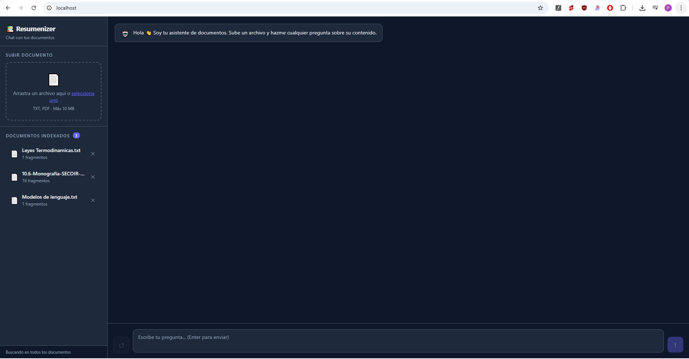
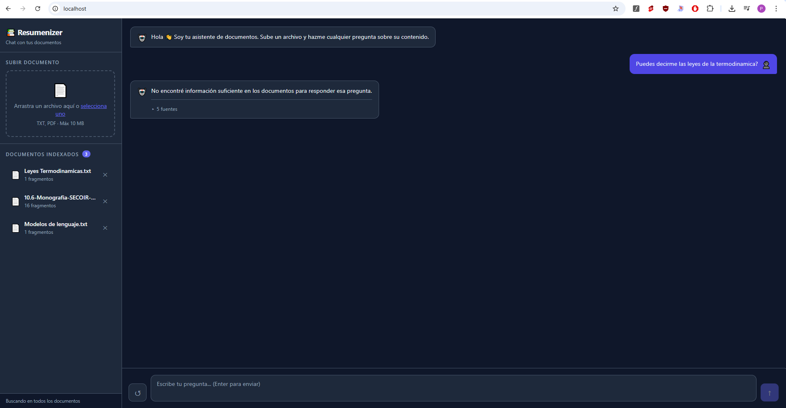
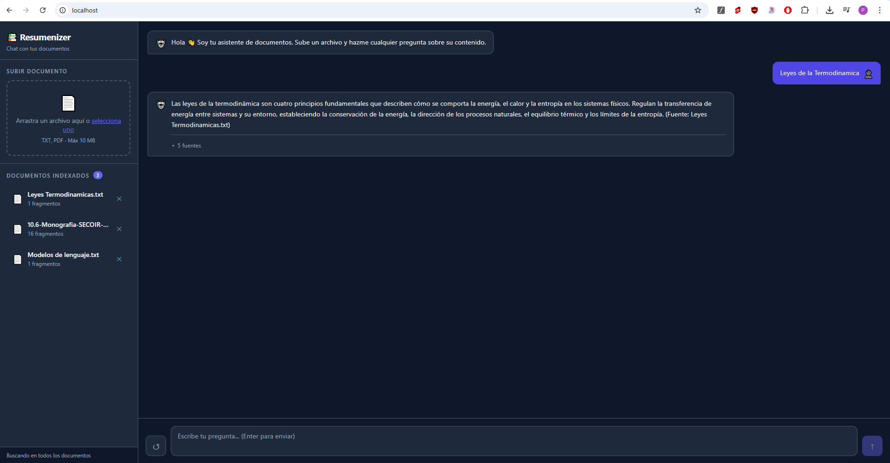
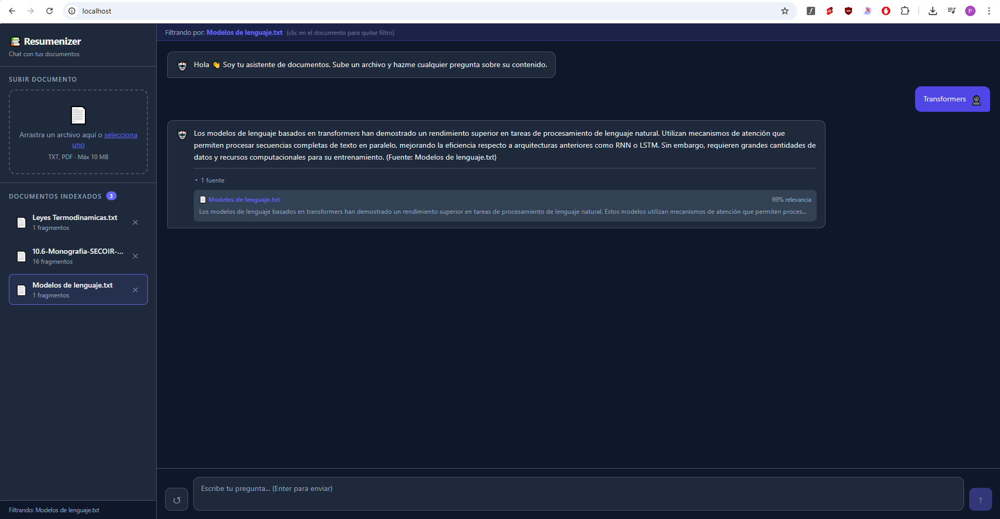

<div align="center">
  
</div>

# Resumenizer — Chat con tus documentos

Resumenizer es una aplicación web que te permite **subir documentos y hacerles preguntas en lenguaje natural**. La IA responde basándose exclusivamente en el contenido de tus archivos, citando los fragmentos exactos que usó para construir la respuesta.

---

## Funcionalidades

### Gestión de documentos
- **Subida por drag & drop** — arrastra un archivo a la zona de carga o haz clic para seleccionarlo desde el explorador.
- **Formatos soportados** — `.txt` y `.pdf`, hasta 10 MB por archivo.
- **Barra de progreso** — indicador visual durante el proceso de indexación.
- **Lista de documentos** — muestra cada archivo subido junto al número de fragmentos en los que fue dividido.
- **Eliminación con confirmación** — modal de confirmación antes de borrar un documento y todos sus fragmentos del índice.

### Chat
- **Preguntas en lenguaje natural** — escribe cualquier pregunta sobre el contenido de tus documentos.
- **Filtro por documento** — haz clic en un documento de la lista para que el chat busque solo en ese archivo; vuelve a hacer clic para quitar el filtro.
- **Indicador de escritura** — animación de tres puntos mientras el modelo genera la respuesta.
- **Enter para enviar / Shift+Enter para saltar de línea** — comportamiento estándar de chat.
- **Reiniciar conversación** — botón para limpiar el historial y empezar de cero.

### Respuestas con fuentes
- **Fragmentos colapsables** — cada respuesta de la IA incluye un desplegable con las fuentes exactas que se usaron para generarla.
- **Score de relevancia** — cada fuente muestra el porcentaje de similitud semántica con la pregunta.
- **Vista previa del fragmento** — los primeros 200 caracteres del fragmento relevante, con el nombre del archivo de origen.

### Notificaciones
- **Toasts** — confirmaciones y errores no bloqueantes para subidas, eliminaciones y fallos de red.

### Capturas de pantalla

**Vista principal — documentos cargados, chat vacío**


**Respuesta sin información suficiente — el modelo lo indica en lugar de inventar**


**Respuesta con fuentes — fragmentos colapsables y score de relevancia**


**Filtro por documento — chat limitado a un único archivo seleccionado**


---

## ¿Cómo funciona?

El sistema implementa el patrón **RAG (Retrieval-Augmented Generation)**, que combina búsqueda semántica con generación de texto. El flujo tiene dos etapas:

### Etapa 1 — Ingestión (al subir un documento)

Cuando subes un archivo, el sistema lo procesa en cuatro pasos:

```
Archivo (.txt / .pdf)
        │
        ▼
1. Extracción de texto
   El sistema lee el contenido del archivo.
        │
        ▼
2. Chunking (fragmentación)
   El texto se divide en fragmentos de ~400 tokens con
   50 tokens de solapamiento entre fragmentos consecutivos.
   El overlap evita perder contexto en los bordes de cada fragmento.
        │
        ▼
3. Embedding
   Cada fragmento se convierte en un vector numérico de 1536
   dimensiones usando el modelo text-embedding-3-small de OpenAI.
   Textos con significado similar producen vectores cercanos en el espacio.
        │
        ▼
4. Almacenamiento en ChromaDB
   Los vectores y el texto original se guardan en disco.
   Esta base de datos vectorial permite búsquedas por similitud semántica.
```

### Etapa 2 — Consulta (al hacer una pregunta)

Cuando escribes una pregunta, el sistema ejecuta cuatro pasos:

```
Pregunta del usuario
        │
        ▼
1. Embedding de la query
   La pregunta también se convierte en un vector con el mismo modelo.
        │
        ▼
2. Búsqueda semántica
   ChromaDB compara el vector de la pregunta contra todos los fragmentos
   indexados y devuelve los 5 más similares (distancia coseno).
   Esto es búsqueda por significado, no por palabras clave.
        │
        ▼
3. Construcción del prompt
   Los fragmentos recuperados se insertan en un prompt estructurado
   junto con la pregunta original. El modelo recibe instrucciones
   explícitas de responder solo con la información del contexto.
        │
        ▼
4. Generación con GPT-4o-mini
   El LLM genera una respuesta fundamentada en los fragmentos.
   Si el contexto no contiene la respuesta, el modelo lo indica
   en lugar de inventar información.
        │
        ▼
Respuesta + fragmentos fuente con score de relevancia
```

### ¿Por qué RAG y no simplemente enviar el documento completo al LLM?

| | RAG | Documento completo |
|---|---|---|
| Documentos largos | ✅ Sin límite | ❌ Limitado por context window |
| Costo | ✅ Solo se envían los fragmentos relevantes | ❌ Se envía todo en cada consulta |
| Velocidad | ✅ Prompt pequeño = respuesta más rápida | ❌ Más tokens = más latencia |
| Múltiples documentos | ✅ Busca en todos a la vez | ❌ Habría que concatenarlos todos |

---

## Stack

| Capa | Tecnología | Rol |
|------|-----------|-----|
| Frontend | React 18 + Vite | Interfaz de usuario |
| Backend | Python 3.11 + FastAPI | API REST + orquestación del pipeline |
| Vector DB | ChromaDB | Almacenamiento y búsqueda de embeddings |
| Embeddings | OpenAI text-embedding-3-small | Conversión texto → vector |
| LLM | OpenAI GPT-4o-mini | Generación de respuestas |
| Servidor | Nginx | Sirve el frontend y hace proxy al backend |
| Contenedores | Docker Compose | Orquestación de servicios |

---

## Inicio rápido

### Con Docker (recomendado)

```bash
# 1. Clonar y entrar al proyecto
git clone <repo>
cd Resumenizer

# 2. Configurar la API key de OpenAI
cp .env.example .env
# Editar .env y poner: OPENAI_API_KEY=sk-...

# 3. Levantar todo
docker compose up --build

# → App:      http://localhost
# → API docs: http://localhost:8000/docs
```

Los datos de ChromaDB se guardan en `./db/` y persisten entre reinicios.

### Sin Docker (desarrollo local)

**Backend:**
```bash
cd backend
python -m venv venv
venv\Scripts\activate        # Windows
pip install -r requirements.txt
cp .env.example .env         # completar OPENAI_API_KEY
python main.py               # → http://localhost:8000
```

**Frontend:**
```bash
cd frontend
npm install
npm run dev                  # → http://localhost:5173
```

---

## Estructura del proyecto

```
Resumenizer/
├── backend/
│   ├── main.py                   # FastAPI: app, CORS, rutas, health check
│   ├── config.py                 # Variables de entorno con pydantic-settings
│   ├── requirements.txt
│   ├── Dockerfile
│   ├── rag/
│   │   ├── chunker.py            # Fragmentación de texto por tokens (tiktoken)
│   │   ├── embedder.py           # Llamadas a OpenAI Embeddings API (batch)
│   │   ├── retriever.py          # ChromaDB: indexar, buscar, eliminar
│   │   └── generator.py          # Prompt engineering + llamada a GPT
│   ├── services/
│   │   ├── ingestion_service.py  # Orquesta: archivo → chunks → ChromaDB
│   │   └── rag_service.py        # Orquesta: pregunta → retrieval → respuesta
│   ├── routes/
│   │   ├── documents.py          # POST /upload, GET /, DELETE /{id}
│   │   └── chat.py               # POST /chat/
│   └── models/
│       └── schemas.py            # Modelos Pydantic de request y response
├── frontend/
│   ├── nginx.conf                # Proxy /api → backend + sirve estáticos
│   ├── Dockerfile
│   ├── index.html
│   ├── vite.config.js
│   ├── package.json
│   └── src/
│       ├── App.jsx               # Layout de dos paneles + estado global
│       ├── api/ragApi.js         # Abstracción de todas las llamadas HTTP
│       └── components/
│           ├── ChatWindow.jsx        # Historial de chat + envío de preguntas
│           ├── MessageBubble.jsx     # Burbuja de mensaje + fuentes colapsables
│           ├── DocumentUploader.jsx  # Drag & drop con progreso de subida
│           └── DocumentList.jsx      # Lista de documentos + filtro + eliminar
├── db/                           # ChromaDB persistente (generado en runtime, no commitear)
├── docker-compose.yml
├── CLAUDE.md                     # Guía para Claude Code
├── .env.example                  # Plantilla de variables de entorno
└── .env                          # API keys locales (no commitear)
```

---

## API

| Método | Ruta | Descripción |
|--------|------|-------------|
| `POST` | `/api/v1/documents/upload` | Sube e indexa un documento (.txt, .pdf) |
| `GET`  | `/api/v1/documents/` | Lista los documentos indexados |
| `DELETE` | `/api/v1/documents/{id}` | Elimina un documento y sus fragmentos |
| `POST` | `/api/v1/chat/` | Ejecuta el pipeline RAG y devuelve respuesta + fuentes |
| `GET`  | `/health` | Estado del sistema y conteo de documentos |

**Ejemplo — subir documento:**
```bash
curl -X POST http://localhost:8000/api/v1/documents/upload \
  -F "file=@contrato.pdf"
```

**Ejemplo — hacer una consulta:**
```bash
curl -X POST http://localhost:8000/api/v1/chat/ \
  -H "Content-Type: application/json" \
  -d '{"question": "¿Cuáles son las cláusulas de rescisión?"}'
```

**Respuesta:**
```json
{
  "answer": "Según el contrato, las cláusulas de rescisión establecen...",
  "sources": [
    {
      "filename": "contrato.pdf",
      "content": "...fragmento relevante del documento...",
      "relevance_score": 0.91
    }
  ],
  "model_used": "gpt-4o-mini",
  "chunks_retrieved": 5
}
```

---

## Mejoras futuras

### Corto plazo
- [ ] **Streaming** — respuestas progresivas con Server-Sent Events (`stream=True` en OpenAI)
- [ ] **Historial multi-turn** — enviar mensajes anteriores al LLM para conversación contextual
- [ ] **Soporte Word / Markdown** — añadir extractores en `ingestion_service.py`
- [ ] **Re-ranking** — cross-encoder después del retrieval para mejorar la precisión

### Mediano plazo
- [ ] **Autenticación** — JWT + colecciones ChromaDB separadas por usuario
- [ ] **Base de datos relacional** — PostgreSQL para metadatos (fecha de subida, tags, usuario)
- [ ] **Cola de tareas** — Celery + Redis para indexación asíncrona de documentos grandes
- [ ] **Cache** — evitar re-generar embeddings para queries idénticas

### Largo plazo
- [ ] **Observabilidad** — LangSmith o Langfuse para trazabilidad del pipeline RAG
- [ ] **Evaluación** — RAGAS para medir faithfulness, relevancy y context precision
- [ ] **Modelos locales** — reemplazar OpenAI por Ollama para uso completamente offline
